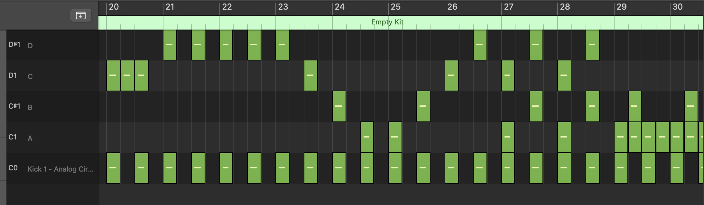
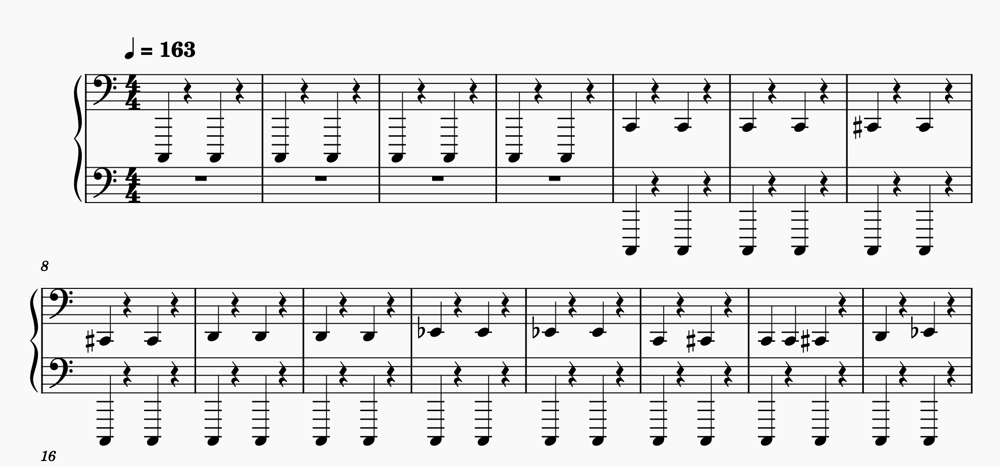
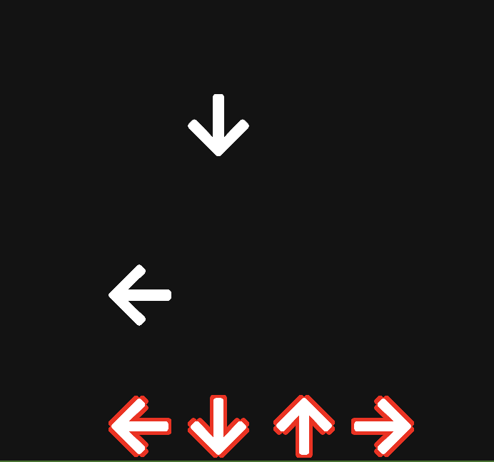

# RhythMidi
- Make your rhythm game charts in a MIDI editor/DAW, then import to Unity
- Easy for players to make their own charts
- Simple event-based note system
- Hit window system for easy note detection







## Getting Started
Download the `RhythMidi` folder and open it in Unity. Open the example scene in `RhythMidi/Assets/Example_DDR/Scenes/Example_DDR.unity`.

To include the SDK in your project, copy all scripts in `Assets/Scripts` into your project. Import namespace `RhythMidi`—and possibly some DryWetMidi classes too.

## Basic Usage
1. Create a new GameObject in the scene and attach the `RhythMidiController` script.
2. Create your own script, similar to `DDRLoader` in the example project.
3. Place your charts in `StreamingAssets/Charts`. `RhythMidiController` will automatically load all charts in this folder. If you don't want to automatically load charts, unset the `chartsPath` variable in Inspector and call `LoadChart` manually. 
4. Set up Note Notifiers, depending on your use case. Call `CreateNoteNotifier`, and add a callback to the returned `OnNote` Unity Action.
5. Call `PrepareChart` with the name of the chart you want to play.
6. Call `PlayChart` to start the game.

### Note Notifiers
A note notifier is a wrapper around a `UnityAction`. The Unity Action will be called `timeInAdvance` seconds before a note is supposed to be hit.

The most basic use of note notifiers is to set `timeInAdvance` to 0. The corresponding Unity Action will be called exactly when a Midi note is triggered.

> Learn by example: `SpriteBop.cs`

Say you want to instantiate a falling note sprite, _x_ seconds before the note reaches the hit zone. You would set `timeInAdvance` to _x_, and instantiate the note whenever the Unity Action is called.

> Learn by example: `DDRLoader.cs`, method `StartGame()`

You can use note notifiers to account for "coyote time" of a rhythm game. However, you can use the `HitWindow` class instead to handle this in a much simpler way.

### Hit Window
A common use case is if you want to detect if the player performed an input while a note was in a "valid window," i.e. between _x_ millis before it triggers and _x_ millis after it triggers.

You can use the `HitWindow` class for this. Attach your hit window behavior to a component and supply it with a reference to the `RhythMidiController`.

When the user performs an input, call `CheckHit(int noteNum)`. The note number should correspond to the midi note number of the note you want to check. It will also, by default, delete the note from the valid window, assuming it has been consumed (to prevent double-hits). It will return a boolean indicating if a note was consumed from the hit window.

If you want to punish players for missing notes, attach a callback to the `OnNoteMissed` Unity Action. This will be called whenever a note exits this hit window without being consumed.

> Learn by example: `DDRLoader.cs`

### Chart Data
A chart consists of three files, in a directory.
1. Manifest
2. Midi
3. Audio

Charts are all stored in StreamingAssets, which are not compiled in, so players can easily make their own maps.

#### `manifest.json`
The Manifest tells your game where to find chart data, as well as some metadata about the chart.

Syntax:
```ts
{
    "game": string, // The name of your game, to disambiguate between charts from different games using RhythMidi
    "manifestVersion": int, // The version of the manifest file. This is used to determine if the chart is compatible with the current version of RhythMidi
    "title": string, // The title of the song
    "artist": string, // The artist of the song 
    "mapper": string, // The mapper of the chart
    "midi": string, // The name of the midi file, relative to the chart directory
    "track": string, // The name of the audio file, relative to the chart directory
}
```

> Learn by example: `StreamingAssets/Charts/ExampleChart/manifest.json`

#### MIDI
You can use any DAW or music score editor to create appropriate MIDI files. A Logic Pro example is included in this repo, but you could also use Ableton, FL Studio, Musescore, etc.

I suggest using a drum rack in your DAW to program charts. You can name each drum pad with the in-game function of the note for convenience.

The MIDI file MUST contain exactly one tempo event. Support for switching tempos mid-chart is WIP.

##### Best Practices
- You should group your note types by octave. Reserve an octave for "system command" notes (e.g. song start, song end, display UI element, tutorial stages, etc.)
- Reserve one noteo to mark the beat. This will keep your game in sync and allow you to do on-beat effects like bopping characters, etc.
- While I haven't tested this, you could make use of velocity data.

#### Audio
The audio file is any format that Unity can natively play. It should line up exactly with the timing of your MIDI file.

## Credits and Contribution
Contributions welcome. Made by [Eric Yoon](https://yoonicode.com).

See license in `LICENSE`. You may use this SDK for development of any game. But, if you are going to make improvements to the SDK itself (not just using it in your game), please make your changes public.

### Games using RhythMidi
- Upcoming Yoonicode rhythm game
- Your game here!
